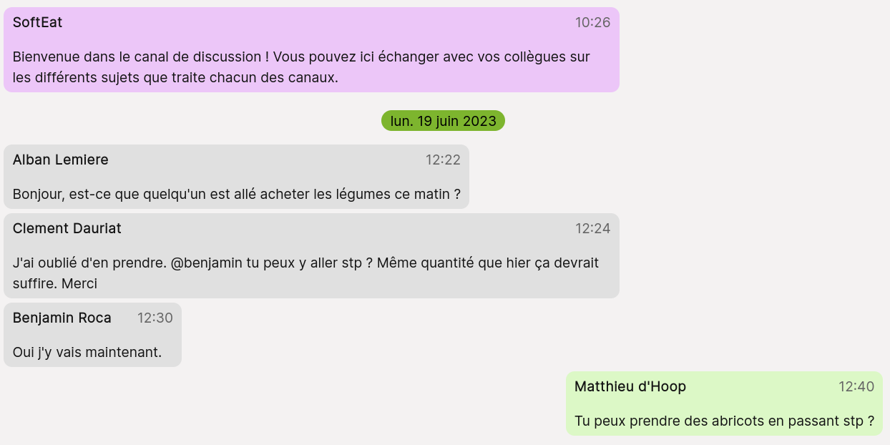
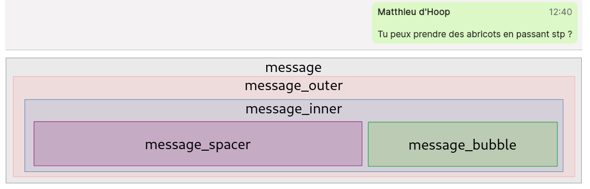

<div align="center">
	<div style="display: flex; justify-content: center; align-items: center; background-color: white; padding: 15px; border-radius: 50%; width: 60px; height: 60px">
		
	</div>
	<h2 align="center">Messagerie</h3>
	<br />
</div>
<br/>

<details>
  <summary>Sommaire</summary>
  <ol>
    <li>
      <a href="#1-structure-de-la-messagerie">Structure de la messagerie</a>
      <ol type="a">
          <li><a href="#a-composants">Composants</a></li>
          <li><a href="#b-modèles">Modèles</a></li>
      </ol>
    </li>
    <li>
      <a href="#2-messages">Messages</a>
      <ol type="a">
        <li><a href="#a-message-template">Message Template</a></li>
        <li><a href="#b-date-template">Date Template</a></li>
        <li><a href="#c-autres-fonctionnalités">Autres fonctionnalités</a></li>
      </ol>
    </li>
    <li>
      <a href="#3-conversations">Conversations</a>
      <ol type="a">
        <li><a href="#a-droits-et-rôles">Droits et rôles</a></li>
        <li><a href="#b-notifications">Notifications</a></li>
      </ol>
    </li>
  </ol>
</details>
<br/>

## 1. Structure de la messagerie

### a. Composants

La messagerie est divisée en 3 composants :
- un template pour l'objet "message"
- un template pour l'objet "date"
- un composant pour la gestion de l'envoi et l'affichage de messages et autres fonctionnalités permettant à la messagerie de fonctionner

### b. Modèles

Le premier modèle `model.ts` regroupe les informations envoyées dans la base de données lors de l'envoi d'un message : 
```ts
export class MessageModel {
	auteur!: string;
	contenu!: string;
	horodatage!: number;
	newDay!: boolean;
	nom!: string;
	prenom!: string;
}
```
>Les champs `nom` et `prénom` sont récupérés dans la base de donnée à partir de l'auteur, qui est contenu dans le cache du navigateur (localStorage).  
>Le champ `newDay` est un booléen indiquant si le message envoyé est le premier du jour ou non. Il permet d'afficher la date du jour au début d'une conversation qui aurait lieu un nouveau jour.
  
Le second regroupe les informations dont l'application a besoin pour afficher les messages correctement :
```ts
export class MessageInfos {
	message!: MessageModel;
	authorIsMe!: boolean;
	isBot!: boolean;

	constructor() {
		this.message = new MessageModel();
	}
}
```
>Les champs `authorIsMe` et `isBot` servent à déterminer l'auteur d'un message et à modifier le CSS selon les cas. Voici les règles établies pour ces champs :
>- je suis auteur du message : message en vert, affiché à droite
>- je ne suis pas auteur : message en gris, affiché à gauche
>- l'auteur du message est un bot : message ne violet, affiché a gauche

Le résultat final ressemble à ceci :


---

## 2. Messages

### a. Message Template



Le template prend en argument un objet `MessageInfos` et deux booléens : `authorIsMe` et `isBot` : 
```ts
<message-template [listeMessages]="messageInfos.message" [author_is_me]="messageInfos.authorIsMe" [isBot]="messageInfos.isBot"></message-template>
```

### b. Date Template

Le template de la date est une simple div, qui prend en argument un timestamp : 
```html
<div>
	<p>{{ this.date | date: 'E dd MMMM yyyy' }}</p>
</div>
```

### c. Autres fonctionnalités

:heavy_check_mark: possibilité d'appuyer sur le bouton envoi ou sur la touche "entrée"  
:heavy_check_mark: message de couleurs différentes selon qui envoie le message
:heavy_check_mark: heure d'envoi de chaque message  
:heavy_check_mark: message automatique par le bot lorsqu'un congé est demandé  


:x: pas de retour à la ligne dans la barre de saisie  
:x: pas d'état lu/non lu sur chaque message  
:x: pas d'animations  
:x: pas d'envoi de fichiers


---

## 3. Conversations

### a. Droits et rôles


### b. Notifications